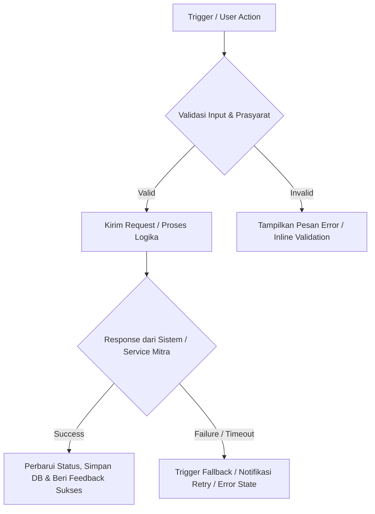

# PRD - [Feature / Module Name]

## Additional Information

| Key | Value |
|:---|:---|
| **Feature / Module** | [Feature or Module Title] |
| **Author** | Rizqi Sarasajati |
| **Date Created** | [YYYY-MM-DD] |
| **Last Updated** | [YYYY-MM-DD] |
| **Date Confirmed** | TBD — confirmation required |
| **Status** | Draft |
| **Version** | v1.0 |
| **Tech Counterparts** | *(Left blank)* |
| **Stakeholders** | Product Team, Logistics Operations, Merchant Operations, Engineering Team, QA Team, Customer Care |
| **QA** | *(Left blank)* |

---

## Summary

### Problem Statement
[Tuliskan masalah utama yang sedang terjadi saat ini secara tajam dan berdasar fakta:
1. Gaps pada flow existing: Jelaskan proses berjalan saat ini dan di titik mana kegagalan/friksi terjadi.
2. Pihak yang terdampak: Sebutkan persona atau pihak spesifik (seller, buyer, operasional, finance, tim CS, mitra kurir).
3. Dampak bisnis & operasional: Jelaskan kerugian nyata seperti penurunan konversi, pesanan batal, proses manual di luar sistem, komplain tinggi, salah klasifikasi data, atau hilangnya visibilitas pelacakan.]

### Opportunity
[Tuliskan peluang dan potensi manfaat jika feature ini diimplementasikan:
1. Efisiensi & otomatisasi proses bagi user maupun internal.
2. Peningkatan GMV, transaksi, atau retensi merchant/buyer.
3. Mitigasi risiko operasional, mismatch billing, atau dispute logistik.]

### Objective
[Tuliskan objective utama secara ringkas, jelas, dan terukur. Hindari kalimat klise atau jargon tanpa sasaran. Jelaskan perubahan terukur yang ingin dicapai terhadap user, sistem, dan bisnis.]

---

## Scope

### In Scope
- [Capability utama 1 yang akan dibangun atau diubah pada fase ini]
- [Capability utama 2]
- [Pemisahan antarmuka, routing logika, atau integrasi spesifik]
- [Penanganan state, validasi, dan feedback sistem]

### Out Scope
- [Fitur atau kemampuan lanjutan yang secara eksplisit tidak dikerjakan pada fase ini]
- [Integrasi downstream atau sistem pihak ketiga yang belum didukung saat ini]
- [Gunakan Out Scope sebagai batas tegas untuk mencegah asumsi lintas tim dan scope creep]

---

## North Star Metric & Measurement

| Metric Type | Metric Name | Definition | How it's Measured | Data Source | Why it Matters |
|:---|:---|:---|:---|:---|:---|
| **North Star** | [Metric Name] | [Definisi terukur dari metrik utama] | [Formula kalkulasi atau cara pengukuran] | [Database / Analytics Table] | [Alasan strategis mengapa metrik ini menjadi kompas produk] |
| **Primary** | [Metric Name] | [Definisi keberhasilan langsung fitur] | [Formula kalkulasi] | [Data Source] | [Validasi adopsi langsung pengguna] |
| **Secondary** | [Metric Name] | [Definisi efek samping positif / adopsi turunan] | [Formula kalkulasi] | [Data Source] | [Mengukur perluasan dampak] |
| **Operational** | [Metric Name] | [Definisi efisiensi teknis / operasional] | [Formula SLA atau durasi proses] | [Service Log / DB] | [Menjamin SLA dan keandalan sistem] |
| **Guardrail** | [Metric Name] | [Metrik penjaga agar tidak terjadi degradasi] | [Tingkat kegagalan, pembatalan, error rate] | [Monitoring / DB] | [Menjaga kesehatan sistem & kepuasan user] |

---

## User Stories

| Ticket | User Story | Acceptance Criteria | Priority | Notes |
|:---|:---|:---|:---|:---|
| **US-001** | As a **[Persona]**, I want to **[capability/action]**, So that **[business value/outcome]**. | Given [kondisi awal/prasyarat sistem], When [tindakan atau pemicu dijalankan], Then [hasil yang diharapkan terjadi], And [efek samping data atau sistem tersimpan]. | **P0 / P1 / P2** | \- Susun notes dalam bullet list terstruktur dengan alur berpikir konsisten. - Jelaskan kondisi pemicu atau data yang digunakan saat proses dimulai. - Jelaskan batasan input dan validasi field: tipe karakter, batas min/max, required/optional, pembersihan whitespace (trim), normalisasi nilai, duplicate check, serta timing aktivasi CTA button. - Jelaskan behavior sistem saat validasi lolos dan user/sistem melanjutkan alur. - Jelaskan feedback antarmuka: toast notifikasi, modal dialog, perubahan status visual, badge state, loading indicator, atau inline error messages. - Jelaskan penanganan kegagalan/eksepsi sistem: timeout API, invalid response dari partner, error boundary, dan fallback behavior. - Jelaskan relasi alur terhadap sistem existing: sebutkan secara tegas apakah flow ini mempertahankan, memperluas, atau mengubah flow sebelumnya. - **PENTING**: Dilarang menampilkan label visual mentah seperti `Input/Trigger:`, `Validation:`, `CTA:`, `UI:`, atau `Relation:` pada dokumen final. Tuliskan seluruh notes secara natural dan mengalir sebagai requirement produk yang spesifik dan testable. |

---

## System Design

### Wireframe / UI Design
- [Jelaskan struktur antarmuka baru, layout halaman, atau navigasi yang ditambahkan]
- [Sebutkan komponen visual utama dan state interaksinya: default state, filled state, active/disabled button, modal dialog, empty state, error state]
- *(Tuliskan N/A jika feature ini murni backend/integrasi API tanpa sentuhan UI pengguna)*

### Flowchart / Diagrams
Feature ini merupakan: **[New Flow / Adjustment Flow Existing / Extension di atas Capability Sebelumnya]**.

**Batasan Alur Kerja Sistem:**
1. **Bagian yang Tetap Mengikuti Development Sebelumnya**:
   - [Daftar alur, validasi, otentikasi, atau endpoint yang tidak diubah dan tetap mengacu ke implementasi lama]
2. **Bagian yang Berubah atau Bertambah pada Flow Baru**:
   - [Daftar logika baru, penambahan field, pemisahan tab, endpoint baru, atau mekanisme dispatch baru]
3. **Bagian yang Secara Eksplisit Tidak Berubah**:
   - [Daftar fungsionalitas sekeliling yang diisolasi agar tidak terdampak risiko regresi]

---

## Notification Template

### In App Notification
| Title | Message | Trigger | Note |
|:---|:---|:---|:---|
| [Judul Notifikasi] | [Isi pesan ringkas dan jelas kepada user] | [Event sistem yang memicu notifikasi] | [Deep link atau target redirect halaman] |

### Email Notification
| Subject | Body | CTA | Receiver Segments |
|:---|:---|:---|:---|
| [Subjek Email] | [Ringkasan isi email dan informasi penting] | [Label Tombol & URL Tujuan] | [Segmen pengguna penerima email] |

### Push Notification
| Title | Message | Trigger | Note |
|:---|:---|:---|:---|
| [Judul Push] | [Pesan ringkas maks. 100 karakter] | [Kondisi pemicu push notification] | [Payload & routing saat notifikasi ditekan] |

---

## Risks & Mitigation

| Risk | Impact | Mitigation |
|:---|:---|:---|
| [Risiko teknis, integrasi mitra, atau ketergantungan pihak ketiga] | High / Medium / Low | [Strategi pencegahan, fallback otomatis, caching, atau circuit breaker] |
| [Risiko operasional, komplain pengguna, atau miskomunikasi] | High / Medium / Low | [SOP tim operasional/CS, petunjuk antarmuka, validasi cut-off time] |
| [Risiko data mismatch, integritas saldo, atau rekonsiliasi] | High / Medium / Low | [Audit trail logging, transaksi atomik, validasi duplikasi payload/idempotency] |

---

## Timeline

| Phase | Start Date | End Date | Owner | Status |
|:---|:---|:---|:---|:---|
| **Requirement Finalization** | [YYYY-MM-DD] | [YYYY-MM-DD] | Product Manager | Draft / Done |
| **UI/UX Design** | [YYYY-MM-DD] | [YYYY-MM-DD] | Product Designer | Draft / In Progress |
| **Engineering Development** | [YYYY-MM-DD] | [YYYY-MM-DD] | Tech Lead / Squad Eng | Draft |
| **Quality Assurance (UAT)** | [YYYY-MM-DD] | [YYYY-MM-DD] | QA Engineer / PM | Draft |
| **Production Rollout / Launch** | [YYYY-MM-DD] | [YYYY-MM-DD] | PM & Operations | Draft |

---

## Appendix

| Reference Type | Detail |
|:---|:---|
| **Related Documents** | [Link ke PRD terkait, SOP internal, atau riset pengguna] |
| **Previous Flow Reference** | [Dokumentasi atau acuan alur sistem existing] |
| **TRD / API Contract** | [Link ke Technical Requirements Document, Swagger/Postman, atau skema payload webhook] |
| **Azure DevOps Epics / Tickets** | [ID Work Items Azure DevOps atau tautan roadmap] |
| **Additional Notes** | [Catatan tambahan, asumsi tervalidasi, atau kesepakatan meeting] |
